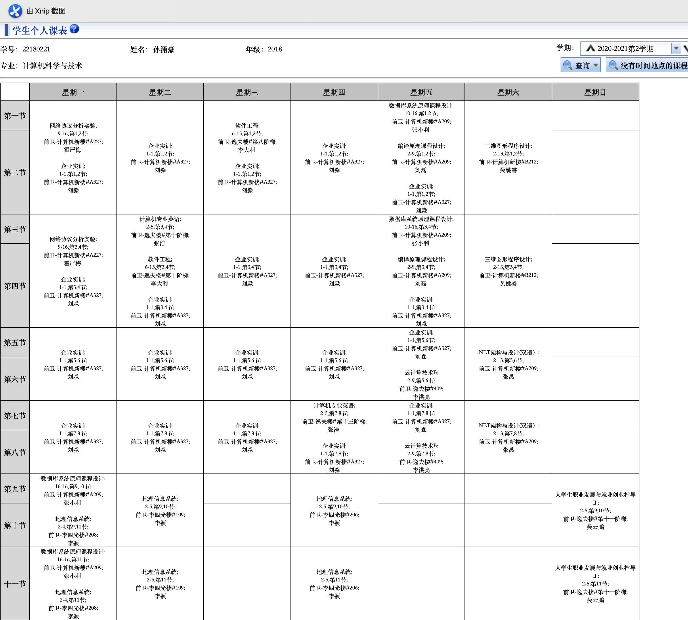

[link to README.md](./README.md)


```
the jpg above is in current directory
```

```
the jpg above is from web
```

## anH2sizedheader
#### anH4sizedheader.

[link to baidu](https://www.baidu.com)

<!-- code block -->
```c++
#include<iostream>
using namespace std;
int main(){
    //body
    return 0;
}
```

`a block quote`

* unorderedlist
* unordered list

1. ordered list 
1. ordered
1. list


<!-- table -->
| name      | email     |  
| --------- | --------- |  
| sunyh     | 11@qq.com |  
| afad      | 22@qq.com|

__bolded text__  
*italic text*

~~strike through~~

<!-- horizontal rule -->
___
